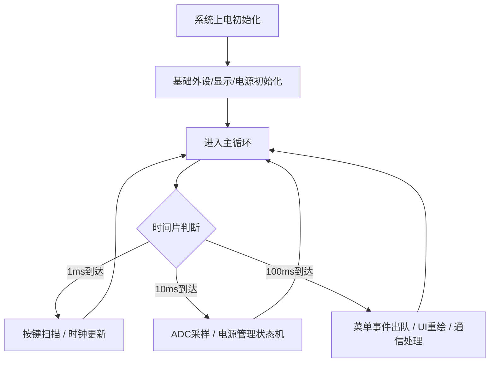
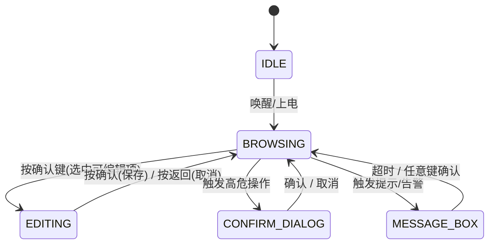
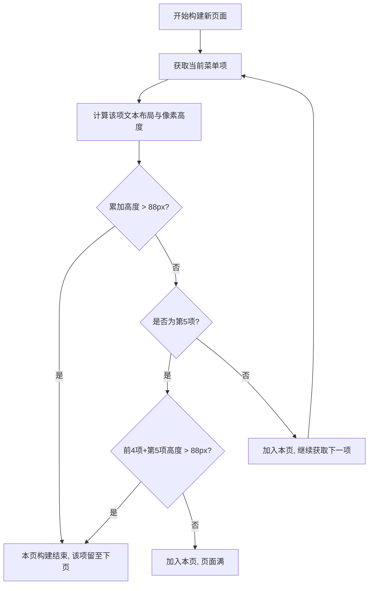
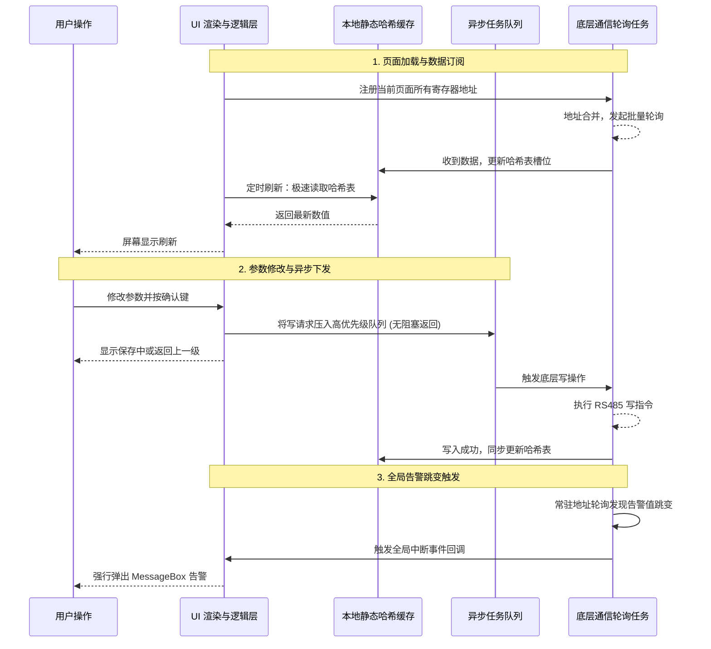

# 手持屏控制器系统综合逻辑架构文档

## 1. 系统整体架构与调度逻辑

系统采用分层架构，从底层硬件驱动（BSP）到应用层（菜单、通信、业务逻辑）逐级解耦。为了保证系统的实时性与稳定性，彻底摒弃了中断阻塞机制，采用**基于主循环的时间片轮询调度**。

### 1.1 硬件版本逻辑差异
- **WiFi版本**：由锂电池供电，包含充电检测、电量百分比计算、15分钟无操作关机、5分钟休眠及低压（<3.1V）强制关机保护逻辑。
- **有线版本**：由外接电源供电，无低压关机逻辑，支持自动休眠与唤醒。

### 1.2 主循环时间片调度
系统在主循环中基于系统滴答定时器分配任务执行周期：
- **1ms 周期**：更新RTC实时时钟、刷新系统时间、执行物理按键的去抖与扫描。
- **10ms 周期**：执行ADC采样（电池电压）、检测USB VBUS充电状态、电源管理状态机、休眠/关机按键检测。
- **100ms 周期**：处理按键事件队列、执行菜单UI重绘与状态流转、驱动RS485/WiFi通信事件。

---

## 2. 菜单状态机与导航流转逻辑

菜单系统是一个严格的状态机，由底层按键扫描生成的标准输入事件（短按、长按、连续触发）驱动。

### 2.1 状态定义与流转规则
系统定义了多个离散状态，任何时刻系统只能处于唯一状态中：
- **空闲状态 (IDLE)**：系统启动或休眠状态。
- **浏览状态 (BROWSING)**：正常在菜单树中上下选择、左右翻页。
- **编辑状态 (EDITING)**：对选中参数（数值、开关、列表）进行修改。
- **弹窗状态 (DIALOG/MESSAGE)**：显示确认操作或全局告警。

### 2.2 按键事件处理流水线
按键逻辑分为：物理层扫描 -> 状态机去抖与时长判断 -> 生成标准事件 -> 入队缓冲 -> 应用层出队分发。长按支持极速连续调整，提升数值修改效率。

---

## 3. UI 界面动态翻页与渲染逻辑

为了提升显示体验，系统从连续滚动模式升级为**动态整页翻页模式**。由于中英文混合换行，菜单项可能占用单行或双行，因此页面容量是动态计算的。

### 3.1 动态页面构建规则
- **高度累加**：遍历当前层级的菜单项，累加各项的实际像素高度。
- **容量上限**：屏幕可用高度上限为 88 像素，累加高度超出时截断，归入下一页。
- **第五项防截断**：一屏最多显示 5 项。若第 5 项高度导致总高度超出 88 像素，则放弃渲染该项，底部留空，防止文本被截断显示。

### 3.2 翻页与光标控制
- **上下键**：在当前页内移动光标。触及页首/页尾时，拒绝跨页移动或直接跳转到上一页/下一页的第一项。
- **左右键**：整页切换。切换后，光标尽可能保持在屏幕中的相对位置。

---

## 4. UI 与底层通信彻底解耦逻辑

为解决界面卡顿和内存碎片问题，UI 渲染与 RS485 收发被彻底物理隔离，采用“缓存+队列+订阅”三大机制协同。

### 4.1 核心解耦机制
1. **静态哈希本地缓存 (Hash Cache)**
   放弃动态内存分配，初始化时通过哈希算法将离散的寄存器地址映射到固定大小的全局数组中。UI 渲染时直接以极低延迟从哈希表中读取缓存值，即使通信未完成也不阻塞界面，仅显示占位符。
2. **异步任务队列 (Async Queue)**
   UI 层的参数修改动作仅将“写指令”打包压入高优先级的写队列后立即返回。底层通信任务在后台独立循环，优先消耗写队列，完成后更新哈希缓存。
3. **页面级按需订阅 (Page Subscription)**
   UI 在发生页面跳转时，将当前页面的所有变量地址打包注册到底层轮询管理器。底层自动合并相近的地址块，生成最高效的批量读指令（0x03），仅轮询当前屏幕可见数据。

### 4.2 告警与事件驱动
针对非菜单页面的全局核心状态（如设备告警），系统在初始化时硬编码注册“常驻轮询地址”。底层通信在轮询中自带跳变检测逻辑，一旦发现告警数据变化，直接触发全局回调，UI 层无论处于什么页面都会强行弹出消息框提示用户。